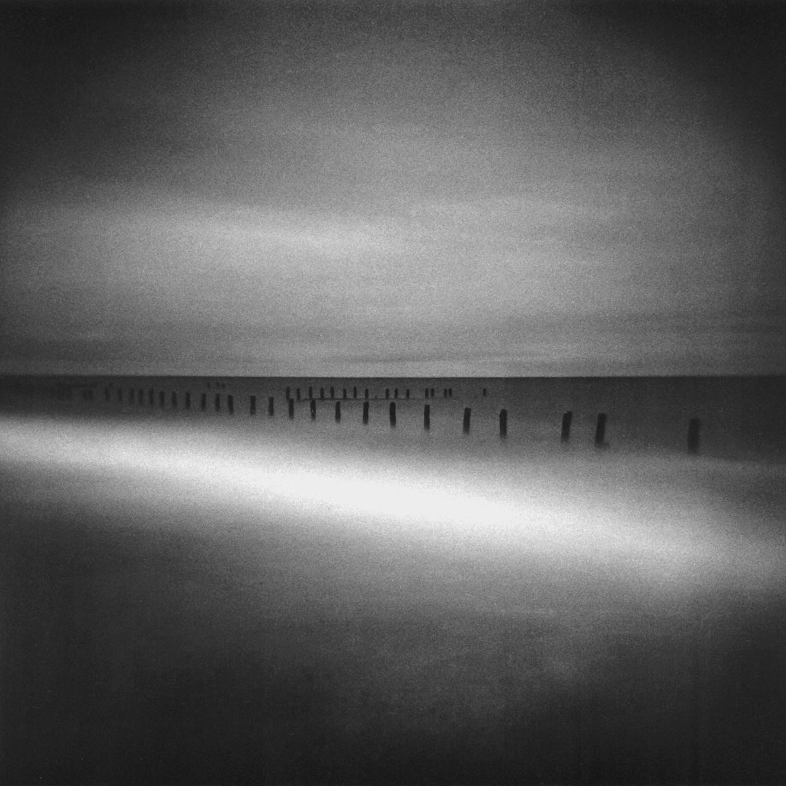
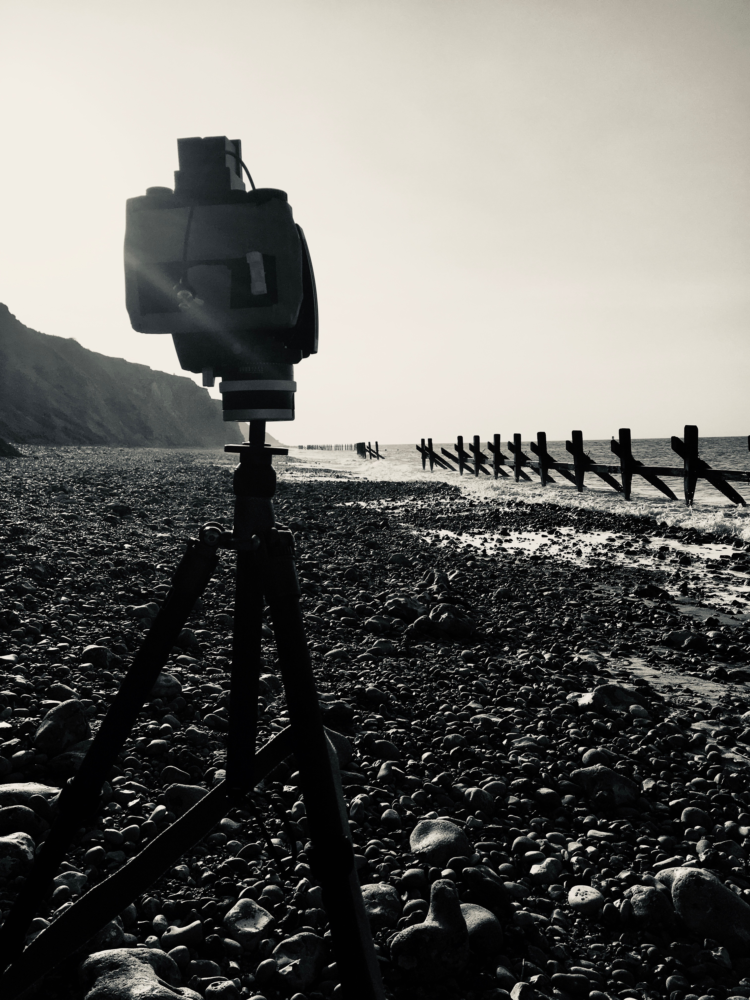

## About Sparrow Fabrications
Sparrow Fabrications started by accident.

I am a photography and camera enthusiast in the United Kingdom. I happened to have bought an [FDM](https://en.wikipedia.org/wiki/Fused_filament_fabrication) 3D printer just prior to COVID-19 locking the world down. I learned a lot about 3D printing by manufacturing [PPE](https://en.wikipedia.org/wiki/Personal_protective_equipment) for my local doctor surgeries, district nurses and care homes whilst such equipment was impossible to come by.

When my cousin asked me to design a cable adapter for his [Holga](https://en.wikipedia.org/wiki/Holga), I couldn't have predicted I would end up producing a range of products for other camera enthusiasts all over the world, or see beautiful photos people have taken with them.

This is one from my cousin using [this adapter](holga-120-adapter). More of his work is available [here](https://josephasghar.com/holga/).

Even his photo of his setup is beautiful!

## Website

All content remains the copyright of Sparrow Fabrications and must not be used without permission.

This site is built on [GitHub pages](https://pages.github.com/) in general and the [Slate theme](https://pages-themes.github.io/slate/) in particular.
