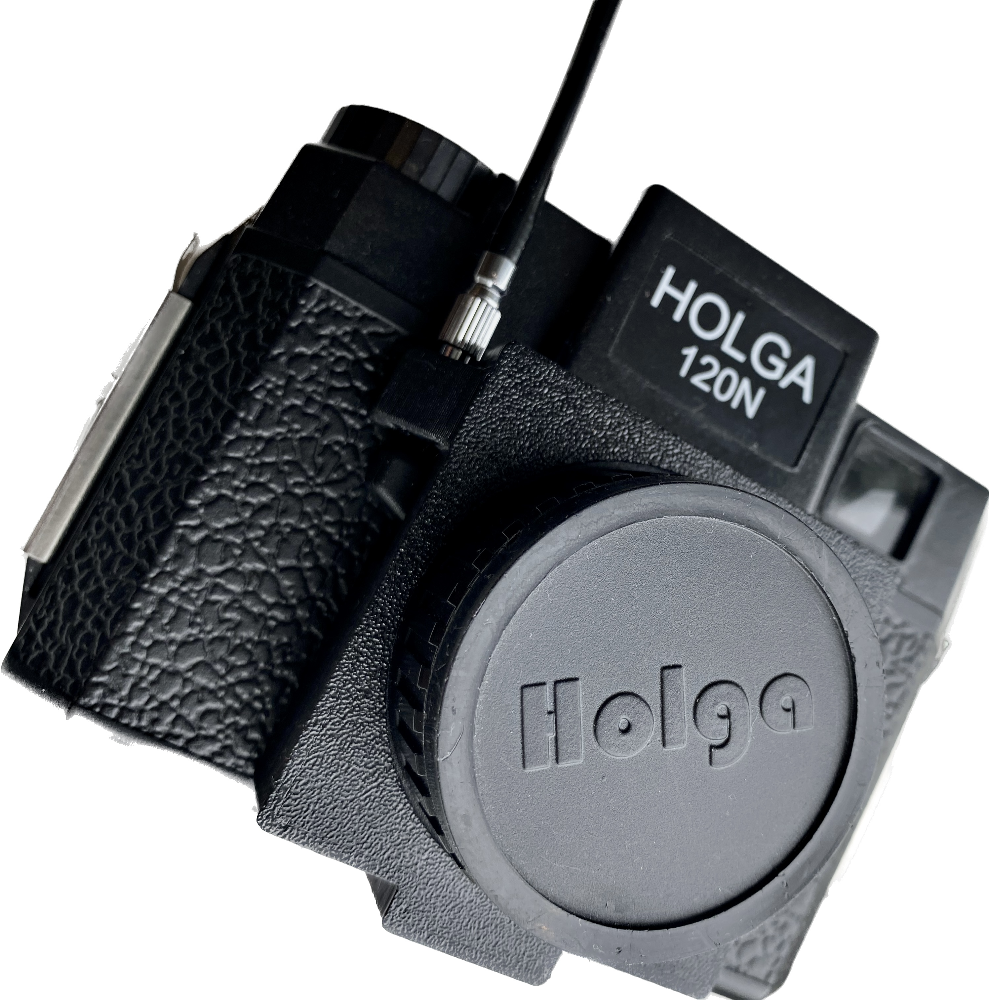

## Welcome!
I manufacture accessories for cameras including the Holga and Diana to allow photography and lomography enthusiasts like myself to get the most out of their cameras.

### Products
Products are individually 3D printed and finished by me. You can purchase products directly from me using PayPal.

If you would prefer you can also purcahse from:

- [eBay UK]({{ site.ebay_uk_url }}) or [eBay US]({{ site.ebay_us_url}}), and
- [Etsy]({{ site.etsy_url }}).

### Feedback
I have had some great feedback about my products which you can see in my product pages.

>Sparrow Fabrications' Holga shutter release adapter is well designed, fits like a glove and works absolutely perfectly. Only item on the market to fit this need. Absolutely perfect! Many Thanks.
>
>*ebay purchaser, April 2023*

>Needed this for travel and the delivery was speedy! made it from the UK to NY in like 3 maybe 4 days. Great communication and friendly!
>
>*ebay Purchaser, September 2023*

I am always keen for feedback on my products so I can continue to improve them.

### Design
The design of my current products has evolved quite a bit based on me using them and from feedback from purchasers. If you have any questions you are welcome to contact me at **{{ site.email_address }}**.

If you have an idea for a product let me know. In the past I have made specific parts for fellow enthusiasts.
