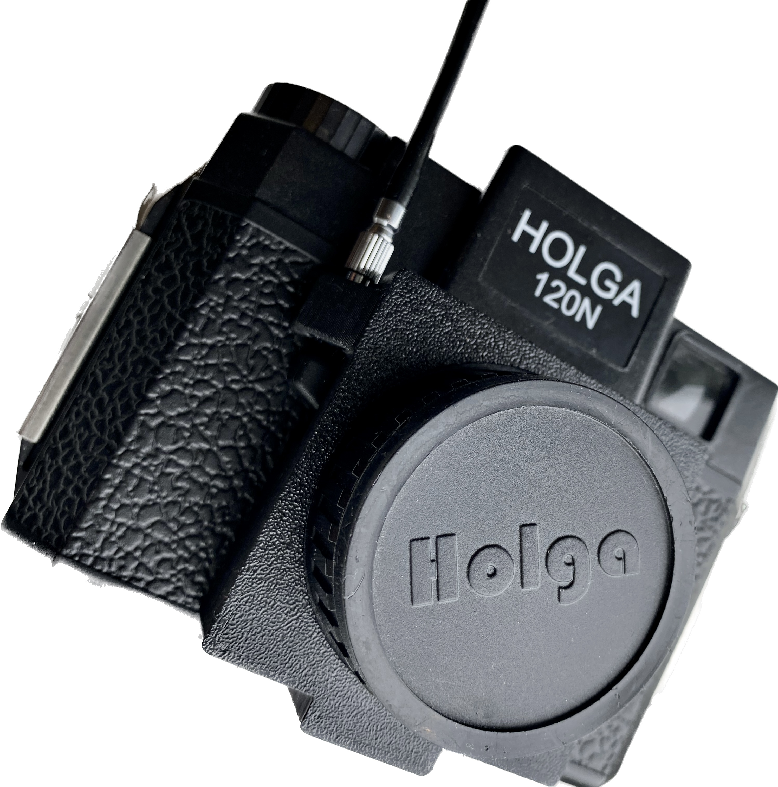

## Welcome

I manufacture precision accessories for cameras including the Holga and Diana — 3D printed in the United Kingdom and designed from scratch for each camera model.

  <a href="{{ site.etsy_url }}" class="btn-primary">Shop on Etsy</a>
  <a href="{{ site.ebay_uk_url }}" class="btn-primary">ebay UK</a>
  <a href="{{ site.ebay_us_url }}" class="btn-primary">ebay US</a>

### Products

Each part is individually 3D printed and hand finished by me. You can [purchase](/purchasing.html) them from Etsy and ebay, or directly from me using PayPal if you're in the UK.

### Feedback

> Sparrow Fabrications' Holga shutter release adapter is well designed, fits like a glove and works absolutely perfectly. Only item on the market to fit this need. Absolutely perfect! Many Thanks.
>
> *ebay purchaser, April 2023*

> Needed this for travel and the delivery was speedy! made it from the UK to NY in like 3 maybe 4 days. Great communication and friendly!
>
> *ebay Purchaser, September 2023*

I am always keen for feedback so I can continue to improve my products.

### Design

The design of my products has evolved quite a bit based on my own use and feedback from purchasers. If you have any questions or an idea for a product, get in touch at **{{ site.email_address }}** — in the past I have made bespoke parts for fellow enthusiasts.
