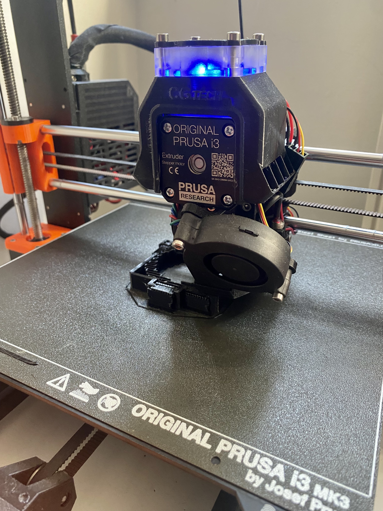
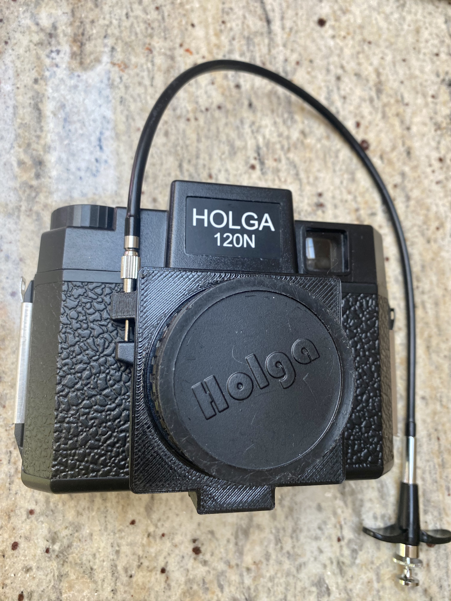

## Manufacturing
All parts are made on my modified [Prusa MK3S](https://www.prusa3d.com/category/original-prusa-i3-mk3s/) using PETG filament.

They are all hand finished band are tested using my cameras for fit and function.

